# Cha Cha20 Poly1305

This library implements the ChaCha20 stream cipher and Poly1305 message authentication code (MAC) as defined in [RFC 7539](https://datatracker.ietf.org/doc/html/rfc7539).
It provides a high-level API for authenticated encryption and decryption using the ChaCha20-Poly1305 AEAD construction.
It provides only the high-level API, and does not expose the underlying primitives (e.g. quarter round, block function) as public APIs.
> [!WARNING]
> This library is intended for educational purposes and should not be used in production environments without thorough review and validation.
> Further development and support is not planned.
> It has not been audited and may contain vulnerabilities.
> Use at your own risk.

## ChaCha20-Poly1305 AEAD Construction

Authenticated Encryption with Associated Data (AEAD) combining ChaCha20 for
encryption and Poly1305 for authentication.
Provides confidentiality for the plaintext and integrity for both the plaintext
and additional authenticated data (AAD).
The only public API of this library.

### Parameters

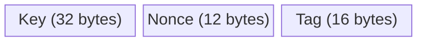

- **Key**: 256-bit secret key, must be random and unique per context.
- **Nonce**: 96-bit value, must be unique per (key, message) pair.
- **Tag**: 128-bit authentication tag produced during encryption and
  verified during decryption.
- **AAD**: Arbitrary-length additional data authenticated but not encrypted
  (may be empty).

### Encryption

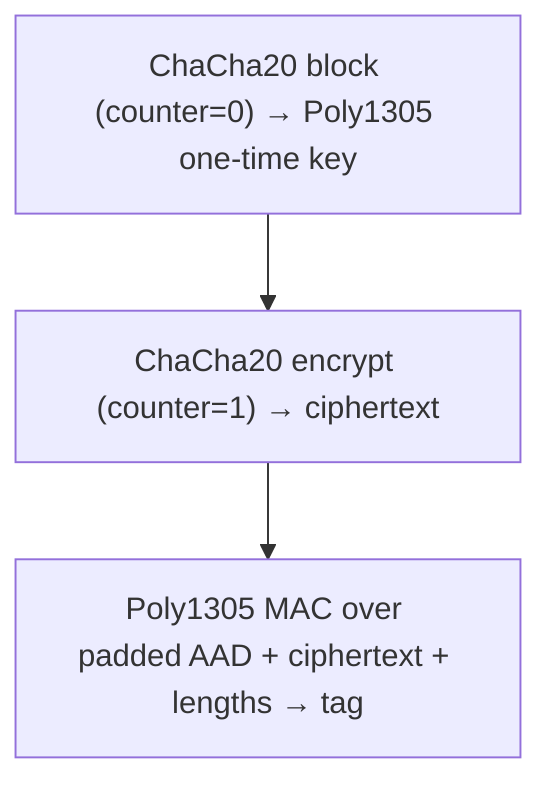

### Decryption

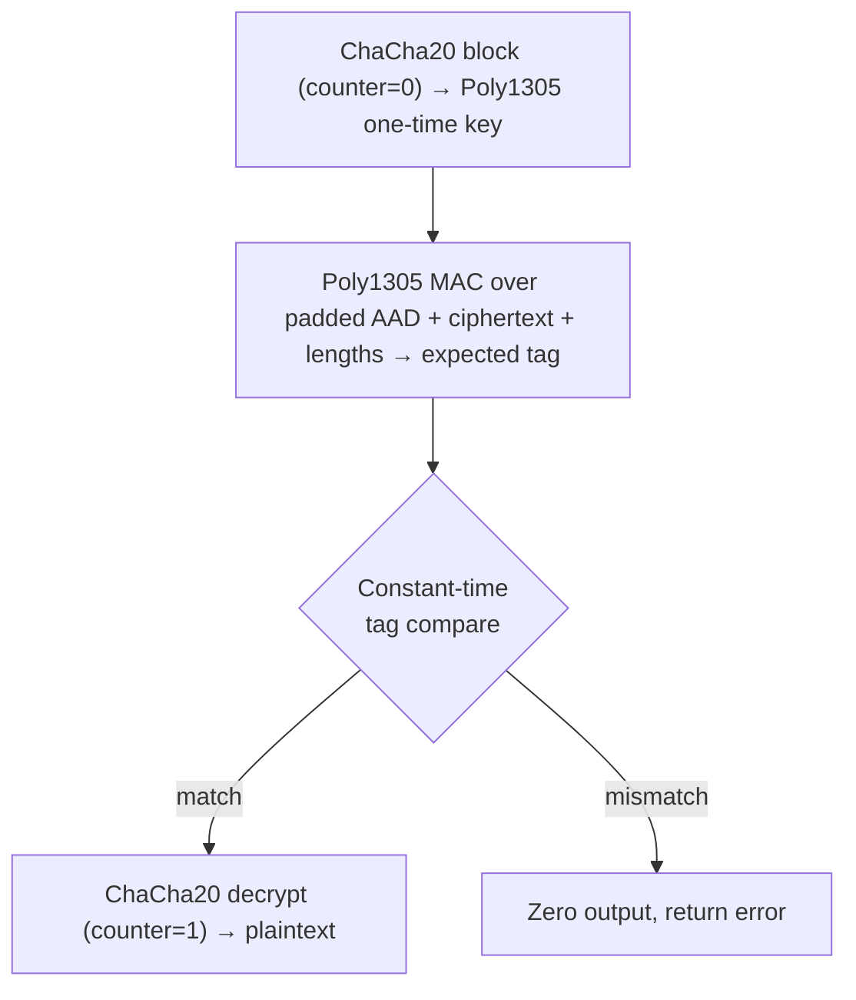

### MAC Input Construction

The Poly1305 MAC is computed over a specific padded layout:

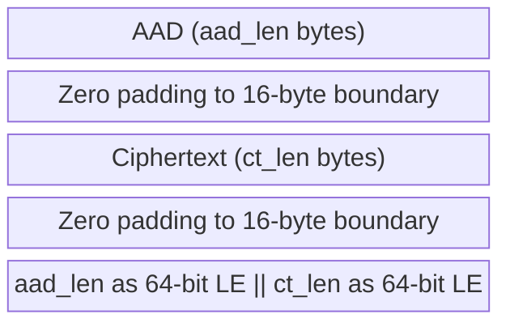

Reference: [RFC 7539-section2.8](https://datatracker.ietf.org/doc/html/rfc7539#section-2.8)

## Chacha20 Stream Cypher Algorithm

ChaCha20 generates a keystream from a 256-bit key, 32-bit block counter,
and 96-bit nonce.  The keystream is XORed with plaintext to produce
ciphertext (and vice versa).

### State Layout

The core operates on a 4x4 matrix of 32-bit words (512 bits total),
initialized from fixed constants, the key, a counter, and a nonce.
All multi-byte values are little-endian.

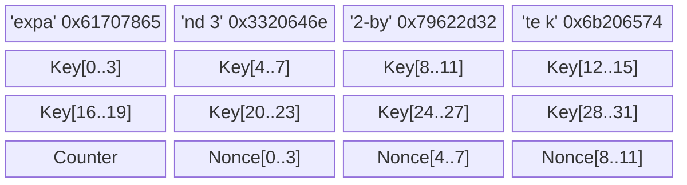

### Quarter Round

The quarter round is the primitive mixing operation.  It takes four words
(a, b, c, d) and applies four add-xor-rotate steps:

    a += b;  d ^= a;  d <<<= 16;
    c += d;  b ^= c;  b <<<= 12;
    a += b;  d ^= a;  d <<<=  8;
    c += d;  b ^= c;  b <<<=  7;

### Block Function

Each block produces 64 bytes of keystream.  The block function initializes
the state, applies 20 rounds (10 iterations of column + diagonal quarter
rounds), adds the original state back, and serializes the result as
little-endian bytes.

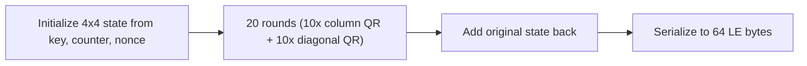

#### Column vs Diagonal Quarter Rounds

Each double-round applies quarter rounds to columns then diagonals
of the 4x4 state matrix:

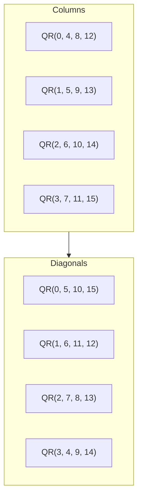

### Encryption

To encrypt a message of arbitrary length, the block function is called
repeatedly with an incrementing counter.  Each 64-byte keystream block
is XORed with the corresponding plaintext chunk.  The final block may
be partial.

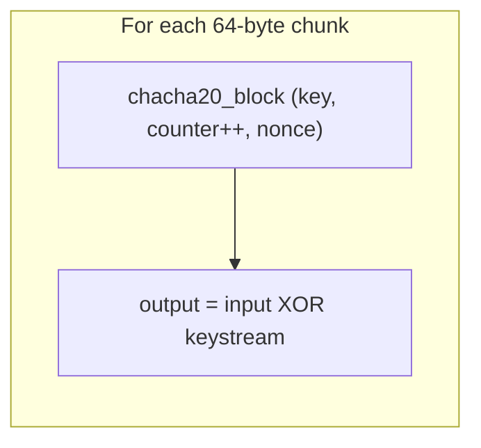

Reference: [RFC 7539-section2.1](https://datatracker.ietf.org/doc/html/rfc7539#section-2.1)

## Poly1305 MAC Algorithm

Poly1305 computes a 128-bit authentication tag over a message using a
one-time 256-bit key.  The key must never be reused.  In the AEAD
construction the key is derived from ChaCha20 block 0.

### Key Layout

The 32-byte key is split into two halves:

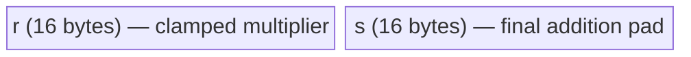

The `r` half is clamped: certain bits are forced to zero to ensure the
multiplier has a restricted form required for security.  Specifically,
the top 4 bits of bytes 3, 7, 11, 15 and the bottom 2 bits of bytes
4, 8, 12 are cleared.

### Internal Representation

Both `r` and the accumulator `h` are stored in radix 2^26 (five 26-bit
limbs in uint32_t), which keeps intermediate products within uint64_t
range during the multiply-and-reduce step.

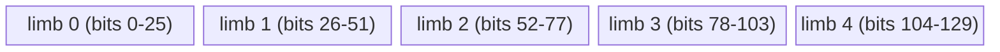

### Processing Flow

The message is processed in 16-byte blocks.  Each block is read as a
little-endian 128-bit integer, a high bit is set (bit 128 for full
blocks, bit 8*len for the final partial block), and the result is
added to the accumulator then multiplied by `r` modulo 2^130 - 5.

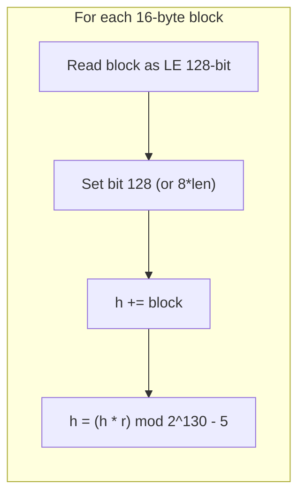

### Finalization

After all blocks are processed, `h` is fully reduced modulo 2^130 - 5,
then the pad `s` is added modulo 2^128.  The lower 128 bits are output
as the 16-byte tag in little-endian order.

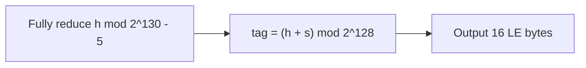

Reference: [RFC 7539-section2.5](https://datatracker.ietf.org/doc/html/rfc7539#section-2.5))
